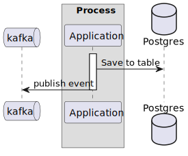

# Employee API - Coding Challenge / Mahdieh Bashiri


## Project description
This project is an implementation of an application that handles the employees of a company.<br/>
It exposes a REST API, allowing other services to communicate with it easily.<br/>

## Requirements
The application must be able to:<br/>
* Create an employee with the following requests:<br/>
```json
{
"email":"mahdieh.bashiri@gmail.com",
"fullName":"bashiri",
"birthday":"2019-04-28T14:45:15",
"hobbies":["soccer","music"]
}
```
* Get a list of all employees.<br/>
* Get a specific employee by UUID.<br/>
* Update an employee.<br/>
* Delete an employee.<br/>

## Bonus Requirements
- (+) Whenever an employee is created, updated, or deleted, an event related to this action must be pushed in Kafka.
- (+) Use [Swagger](http://localhost:8080/swagger-ui/) to expose the application endpoints.
- (+) Use Postgres to store the employee's data in the DB.

## Prerequisites
To build and run this application, you need to have the following installed:

- Java Development Kit (JDK) 11 or later: [Download](https://www.oracle.com/java/technologies/javase-jdk11-downloads.html)
- Apache Maven: [Download](https://maven.apache.org/download.cgi)
- Docker: [Download](https://www.docker.com/products/docker-desktop)

## Getting Started

Follow these instructions to get the project up and running on your local machine.<br/>
1.Clone the repository from GitHub:
```shell
git clone https://github.com/
 ```
2.Navigate to the project directory

3.Build the project using Maven:
```shell
mvn clean install
   ```
4.Run Docker:
```shell
docker-compose up -d
   ```
5.Run Spring boot application:
```shell
mvn spring-boot:run
   ```
6.Run Tests:
```shell
mvn test
   ```
## Can Be Improved
* Please note that due to the absence of an OAuth2 server in my current implementation, I have left the relevant code commented out.<br/>
Rest assured, I am committed to ensuring the safety of the data to integrate OAuth2 authentication.<br/>
* Database Table improvement based on relation between Employee and Hobbies.<br/>
* Add validator for input like Email.
## Diagram



